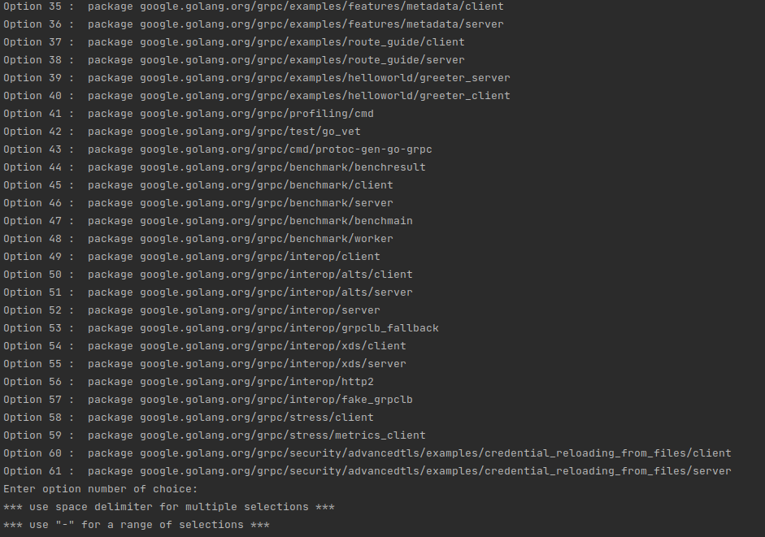

# Go2 Race Detector (new pta version)

 
## Build and install race-checker

Make sure Go is installed in the system. In the go2 repo, checkout this branch with new PTA. 
```
git checkout pta_replaced
```
In go2/race_checker, execute
```
go build
```
Dependencies will be automatically downloaded. By default, the built artifact is named `race-checker`.

Install the race-checker in the PATH by executing
```
go install
```

### Running on gRPC

After installing race-checker, go to the root directory of the gRPC repo, 

Execute race-checker in the **main** directory of a Go program, followed by the path with which to start analysis from, 
```
race-checker ./
```
or 
```
race-checker ./examples/helloworld/greeter_client
```

When multiple entry points are identified, race-checker will request your input for which entry-points to analyze



For example, if you would like to analyze entry points 1 to 20, just enter
`1-20`

or if you would like to analyze the entry point **google.golang.org/grpc/examples/helloworld/greeter_client**, just enter
`40` 
as shown in screenshot above. 

*Your option number may be different for this specific entry point. 


or use the `-analyzeAll` flag since the very beginning if trying to run all entry points, 
```
race-checker -analyzeAll
```
but process may get killed if running out of memory...
