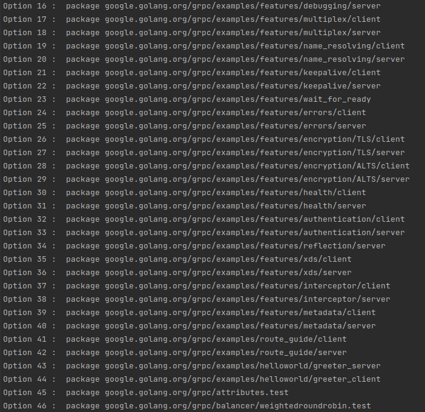
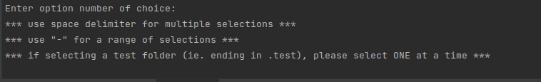

# GoRace Detector

 
## Build and install the tool

Make sure Go is installed in the system. 
In go2/gorace, execute
```
go build
```
Dependencies will be automatically downloaded. By default, the built artifact is named `gorace`.

Install the tool in the PATH by executing
```
go install
```

### Configuration

Update the gorace.yml file (located under go2/gorace) with your preferred config options and place it under the directory where gorace will be executed at. 


### Running the tool

Use the -stack flag to show call stack of racy accesses. 
```
gorace -stack
```

### Running on gRPC

After installing race-checker, go to the root directory of the gRPC repo, 

Execute race-checker in the **main** directory of a Go program, followed by the path with which to start analysis from, 
```
gorace ./
```
or 
```
gorace ./examples/helloworld/greeter_client
```

When multiple entry points are identified like shown below, 



gorace will request your input for which entry-points to analyze, 



For example, if you would like to analyze entry points 1 to 20, just enter
`1-20`

or if you would like to analyze the entry point **google.golang.org/grpc/examples/helloworld/greeter_client**, just enter
`44` 
as shown in screenshot above. 


or use the `-analyzeAll` flag since the very beginning if trying to run all entry points, 
```
gorace -analyzeAll
```
