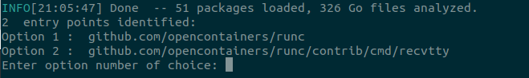
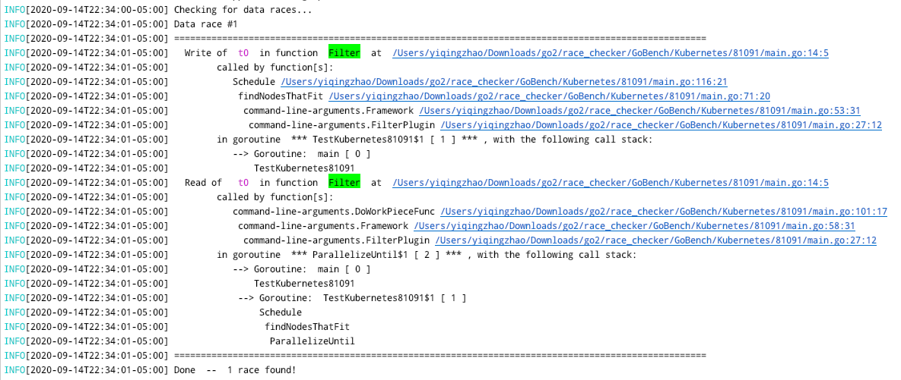

# Go race detector


## Build instructions

Prerequisites: Go 1.2+

First, build the checker in the current folder.
Dependencies will be automatically downloaded.
```
go build
```
By default, the built artifact is named `race-checker`.
Usage:

```
./race-checker <options>
```

Supported options:

- `-collectStats`: Show a report of analysis statistics.
- `-debug`: Show debug information.
- `-help`: Show all command-line options.
- `-withComm` or `withoutComm`: Run the analysis with / without consideration of channel communication. To be used when running real programs. 


### Installation instructions (for use when running a real program)

To install the race-checker in GOPATH,
```
go install
```

To test if the binary is installed correctly and show all the options,
```
race-checker -help
```

### Running tests

To run all the end-to-end tests (file list in `race_test.go`),
```
go test
``` 

The above command runs the tests concurrently. 
The number of workers equals to the number of cores available by default.
To set the number of cores to use explicitly, use the `-cpu` option.

To run individual end-to-end tests,
```
go test -files <test_file>
```

### Running real programs

In root directory of tested repo, 

Add $GOPATH/bin to $PATH if not already done so, 
```
export PATH=$PATH:$(go env GOPATH)/bin
```

Execute race-checker,
```
race-checker -debug -withoutComm
```
or
```
race-checker -debug -withComm
```

### Entry-point selection

After loading all relevant packages for the tested program, if multiple entry-points are detected, manual input will be required in selecting which one to begin analysis with. For example, 




### Sample Output

Positive race result would be shown as follows, 


### Real-world benchmarks

A catalogue of real-world programs to be tested on: 
https://docs.google.com/spreadsheets/d/1XQznzDadxw9Tp6SVOCBndSTy3J65N1CscJUBRZwrcTU/edit?usp=sharing
